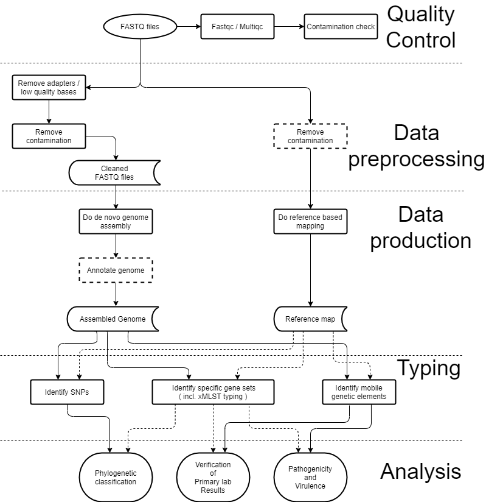

# Sequence analysis Pipelines

In recent years next generation sequencing has matured and with that a
solidification on the required methods for WGS projects has occurred.
Nonetheless, the current practice of microbial WGS is mostly confined to the
academic world, and has not yet resulted in large scale introduction of WGS in
clinical settings, with the exception of a few countries. However, while it
is clear that as the technological developments in bioinformatics proceed at a
rapid pace, a consensus has formed on which steps are required to produce WGS
datasets that can be used for surveillance and outbreak detection and
investigation. These steps involve quality control of the raw
sequence data and a subsequent usage of clean data to produce an annotated
genome or reference map. Such “products” can then be used to obtain typing data,
which is needed for the final analysis under surveillance or outbreak scenarios.
These steps are illustrated in the figure below.

The first part of the process is to ensure that the quality of the reads is
sufficient to proceed. Then, reads are 'trimmed', i.e. low quality parts are
and adapters are removed, and they are checked for any contamination. Once the sequence data is clean, it can then be used in two different processes.

- Genome assembly, which is the computational process of combining all the
shotgun DNA sequences in order to recreate the original genome sequence of an
organisms.
- Reference mapping, which is the alignment of the shotgun sequence
fragments to a chosen reference genome, in order to identify differences between
the reference and the investigated isolate.

Based on either a mapping or a genome assembly, the isolates can be
further characterized through various typing and clustering tools. Different
tools need different inputs - in most cases they either take an assembly or
reads, but not both. It should be noted that the read mapping pathway is
usually a lot less computationally expensive than the assembly pathway.

As is evident from the processes described here, the tool chain needed for
analysis can get quite complicated. For these purposes it can often be useful
to either use a workflow language, like Nextflow and Snakemake, or to use
an analysis platform, like those described under
[Data management and analysis platforms](../Infrastructure/DMAPS.md).
Without such systems it can get quite complicated to keep account of what
analysis has been done, and the version of tools used.  
