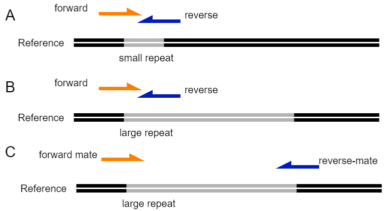

# Sequencing Technologies

## Shotgun sequencing

Most sequencing projects use [shotgun
sequencing](https://en.wikipedia.org/wiki/Shotgun_sequencing) of DNA, cDNA or
RNA fragments to produce sequence data that can be used for various analysis
types such as whole genome assembly, transcriptomics or metagenomics. To do
shotgun sequencing the genetic molecule is randomly fragmented using mechanical or chemical shearing. The random fragments are then size selected and analyzed using either
[short](https://en.wikipedia.org/wiki/DNA_sequencing#Short-read_sequencing_methods)
(25-500 bp) or [long](https://en.wikipedia.org/wiki/Third-generation_sequencing) (> 1000 bp) read sequencing platforms. The intermediate size (500-1000 bp) fragments are not used in large scale sequencing projects, but they are typical for Sanger sequencing platforms, such as the ABI3100. Such fragments are now typically used for the closing of genomes, or the sequencing of cloned PCR products.

## Short read sequencing
Short read sequencing is the analysis of short DNA / cDNA fragments (25-500 bp) using second or [next generation sequencing](https://en.wikipedia.org/wiki/Massive_parallel_sequencing) platforms. The second generation sequencing platforms are characterized by a much higher throughput than the original first generation or Sanger sequencing platforms. The dominant methods can be divided into two groups: 1) sequencing by synthesis or 2) sequencing by ligation.  

[Sequencing by synthesis](https://en.wikipedia.org/wiki/Illumina_dye_sequencing) is performed using a polymerase that incorporates nucleotides. These nucleotides can be fluorescently labeled and then the incorporation of nucleotides is registered optically with a camera (Illumina or 454). Another detection method is by using ion sensors that monitor the release of hydrogen ions when a nucleotide is incorporated. Upon incorporation an electronic signal is produced (Ion Torrent semiconductor sequencing).

Sequencing by ligation is a technique where the sequencing reaction is performed by a ligase and not a polymerase. The ligase anneals short one or two base encoded probes to a sequence. After non-ligated probes are washed away, a camera measures which probes have been ligated and the color of the probe gives the nucleotide composition. This technique is represented by SOLID or DNA nanoball sequencing.

## Paired-end sequencing
Shotgun sequencing of short DNA fragments (200-800 bp) is done by sequencing from either one end of the fragments (single-end sequencing) or from both ends of the molecule. In the later case it is called short fragment paired-end sequencing, because it generates two sequencing reads (one from each end) which correspond to the extremities of the same fragment. If the insert size (i.e. the genomic distance separating the two reads) is short enough compared to the read length, it is possible that the sequencing from both ends of the fragment generates reads that can be combined into one fragment encoding the original fragment. In this regard, it is important to note that the read size directly depends on the sequencing platform that is used. For instance, contrary to other Illumina platforms, Illumina MiSeq, one of the most used platforms for microbiology research, allows the sequencing of 2 x 300bp reads.

The advantages of paired-end sequencing over single-end sequencing are several. In the case when both reads align it is possible to correct sequencing errors in one of the reads by using a base with a higher Phred score (higher sequencing quality) located on the other read. This is widely used in amplicon sequencing. Another advantage is that paired-end sequencing improves genome assembly as the distance between reads pairs provides additional information on the relative position of the reads in the genome. In addition, it can solve structural rearrangements, such as gene deletion However, short fragment paired-end sequencing will not resolve large repeats found in most genomes such as rRNA operons as the length of those repeated regions is superior to the distance between reads. There long-read sequencing or mate-pair sequencing is needed to assist the assembly process.

This figure shows how short-read sequencing can be used to solve repetitive regions during genome assembly. A) A small repeat with a size smaller than the insert size of a paired set of reads. Here the location of the repeat is solved because both reads contain information on the repeat and on the sequence outside the repeat. B) The location of a large repeat (size larger than insert size of paired reads) can not be solved by a normal paired-end sequencing, since it is unclear to which part of the genome the reverse read belongs. In addition, there will be many reads mapping inside the repetitive regions. C) Mate-pair sequencing reads that have large insert sizes can be used to identify the correct location of a repetitive area because they match both the repeat and the area outside the repeat.

## Mate-pair sequencing
In the case where the insert size of a fragment is much longer than the read
length it is possible to do mate-pair sequencing. In mate-pair sequencing a
library is created of large fragments (for example 10 Kbp) and only the ends of
these fragments are sequenced. In order to create mate-pair sequencing
libraries, the ends of the fragments are biotinylated and then the fragments are circularized by joining the biotinylated ends. The circularized fragments  are then digested and the smaller biotinylated fragments are captured. These are then prepared in the same way as short fragment paired-end sequences and sequenced from both ends (see [this
figure](https://www.ecseq.com/support/ngs/what-is-mate-pair-sequencing-useful-for)). Because the original location of the mate-pair sequences was much further apart, it is possible to use mate pair sequences to bridge contig caps that were generated after paired-end sequencing. This technique is slowly becoming obsolete due to the improvements in long-read sequencing

## Long read sequencing
Third generation sequencing, or “true” long read sequencing, is a method where
long DNA fragments are analyzed individually (reviewed in: [Amarasinghe, S.L. et al. 2020](https://genomebiology.biomedcentral.com/articles/10.1186/s13059-020-1935-5) & [Mantere, T. and Hoischen, A. 2019](https://www.frontiersin.org/articles/10.3389/fgene.2019.00426/full)). This is different from “synthetic” long read sequencing where synthetic long reads are produced using a variety of methods that link short read sequences using barcoded adapters, proximity ligation, or via optical mapping (section 8 in: [Amarasinghe, S.L. et al. 2020](https://genomebiology.biomedcentral.com/articles/10.1186/s13059-020-1935-5)). With true long read sequencing fragmented DNA does not need to be amplified as is the case for most next/second generation sequencing techniques. Long read sequencing is dominated by two companies with different methods: Oxford Nanopore sequencers (minION, gridION, promethION) and Pacific biosciences with their SMRT (Single Molecule, Real-Time) sequences (Pacbio RSII / Sequel Sequel II) ([Amarasinghe, S.L. et al. 2020](https://genomebiology.biomedcentral.com/articles/10.1186/s13059-020-1935-5)). These companies provide platforms that allow for true long read sequencing.

True long read sequencing as performed by the Oxford Nanopore machines depend on measuring a change in the ionic current when a base on a DNA strand is pulled through a nanopore (section 8 in: [Amarasinghe, S.L. et al. 2020](https://genomebiology.biomedcentral.com/articles/10.1186/s13059-020-1935-5)). The Nanopore is a protein that is embedded in an electrically-resistant polymer membrane. The Nanopore and the membrane are together integrated into a microscaffold, which is part of sensorchip. Each microscaffold is connected to its own electrode which is attached to its own channel of the sensory array chip (The ASIC) [https://nanoporetech.com/how-it-works)](https://nanoporetech.com/how-it-works). By measuring the change in ionic current it is possible to determine what kind of a nucleotide is passing the pore. Nucleotides have different properties which causes a specific change in the ionic current, and thus allows for the detection of methylated bases as well. The read length for Nanopore sequencing is dependent on being able to load high molecular weight onto the flowcell.

The SMRT technology developed by Pacific Biosciences uses polymerases that are
attached to the bottom of picoliter-sized wells. Incorporation of a nucleotide
is detected in real-time via the emission of a fluorescence signal. The read
length of this technique is limited by the resilience of the polymerase to stay
active. In addition, the error rate with SMRT sequencing is depending on how
often a DNA molecule is read by the polymerase. The SMRT sequencing therefore
comes as two variants: Continuous Long Read (CLR) sequencing and Circular
Consensus Sequencing (CCS). For the later the molecules are only sequenced once
and this allows for very long sequences. With CCS sequencing the DNA molecules
are circularized, so called circular SMRTbell DNA molecules. These molecules are
read by a polymerase. With every pass of the molecule all bases are read, and
since errors are randomly introduced, it is possible to identify which
basecalles are incorrect. Thus the repeated reading of the same molecule allows
for error correction, and improves the error rate (see figure 3 in [D’Amore et
al.,
2016](https://bmcgenomics.biomedcentral.com/articles/10.1186/s12864-015-2194-9)).
Nonetheless, indels in homopolymers are still a problem in SMRT
sequencing ([Amarasinghe, S.L. et al.
2020](https://genomebiology.biomedcentral.com/articles/10.1186/s13059-020-1935-5)).

The error rate with nanopore sequencing is higher than with SMRT sequencing due
to the fact that not one but five bases affect the ionic current over the
membrane. With SMRT sequencing a single signal is emitted for each base, while
with Nanopore five bases affect the signal. Indels and substitutions are partly
randomly distributed but not in a uniform manner ([Amarasinghe, S.L. et al.
2020](https://genomebiology.biomedcentral.com/articles/10.1186/s13059-020-1935-5)).
The error rate in Nanopore sequencing is dependent on a uniform translocation
speed along the pore, which can be affected by a variety of factors such as
temperature, modified bases, 3D-structure of the DNA, etc. In addition, the
structural and chemical characteristics of the pore play a role in error rate.
Therefore a lot of development goes into improving this by developing
basecalling algorithms that can identify the correct base even though the signal
from the nanopore sequencer is very noisy.

## Short vs long read sequencing
The main advantage of long read sequencing is that the sequences are often
longer than 10 Kbp, which improves a lot the assembly quality known from short
read sequencing. For instance, the assembly of microbial genomes using short
reads is often hampered by repeats such as the rRNA operon that prevent the
closing of the genomes. Long reads can span such large regions thus allowing the completion of genomes. A disadvantage of the long reads is that the error rate of long sequences are much higher than with short read sequencing. A lot of study goes into the improvement of the error rate such that downstream issues with this high error rate are resolved. There is a wide variety of methods available that can help to reduce the sequencing error found in long reads. These approaches are divided in error-correction methods that either use only the long reads (non-hybrid) and methods that include short read sequencing information (hybrid) to remove errors (reviewed in detail in [Amarasinghe, S.L. et al. 2020](https://genomebiology.biomedcentral.com/articles/10.1186/s13059-020-1935-5)). This can be done before assembly, by aligning the reads and generate consensus sequencing. In addition, errors can also be resolved after genome assembly is performed by mapping either only the long reads or in combination with short reads. This is an iterative process and is called polishing. Last, but not least, a major difference between long and short read sequencing is the cost. Illumina sequencing is per isolate around 70-100 Euros depending on what machine that is used, while Nanopore is about 50% higher than that, and Pacbio is about 4 times as high. Note, these numbers are current as of spring 2021, so these are likely to change.
