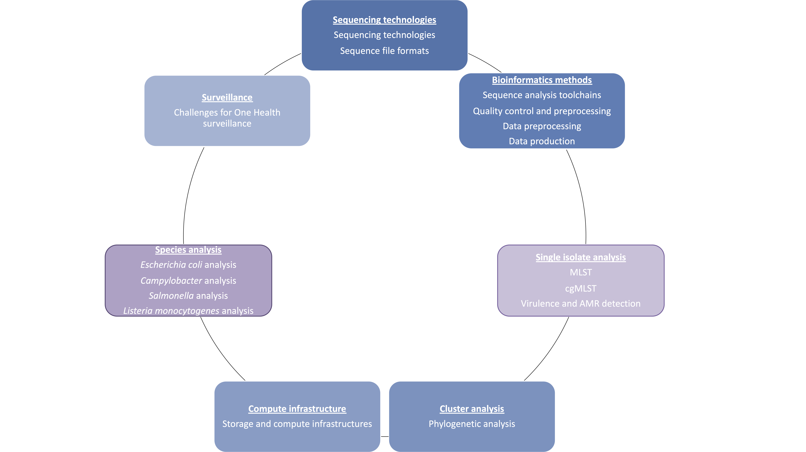

# About the OH SFS Handbook

The work found in these pages got its start in the ORION project and continued in the 
frame of the BeOne project. The ORION project, launched in 2018, is aimed at establishing 
and strengthening inter-institutional collaboration and transdisciplinary knowledge transfer 
in the area of surveillance data integration and interpretation, along the One Health (OH) 
objective of improving health and well-being. The BeOne project, launched in 2020, aims at 
developing an integrated surveillance dashboard in which molecular and epidemiological data 
for foodborne pathogens can be interactively analysed, visualised, and interpreted by the 
relevant experts across disciplines and sectors.

Through three main work packages (WP), **ORION’s specific goals** can be summarized as the 
delivery of three main resources:

- a “OH Surveillance Codex” (WP1) - a high level framework for harmonised,
cross-sectional description and categorisation of surveillance data covering all
surveillance phases and all knowledge types;
- a “OHS Knowledge Hub” (WP2) - a
cross-domain inventory of currently available data sources, methods / algorithms
/ tools, that support OH surveillance data generation, data analysis, modelling
and decision support;
- “OHS Infrastructural Resources” (WP3) – that are
practical, infrastructural resources forming the basis for successful
harmonisation and integration of surveillance data and methods.

Through its WP1, the **BeOne project** targets the typing and nomenclature issues 
that exist within WGS-based pathogen surveillance and outbreak detection. The goals of this WP 
can be summarized as:

- establishing the current state of the art within genomics methods for WGS‐based typing;
- providing a strain dataset to capture the genomic diversity within the populations of four 
  main pathogens: _Salmonella enterica, Escherichia coli (STEC), Listeria monocytogenes_ and
  _Campylobacter jejuni_;
- assessing cluster agreement between different WGS-based typing approaches to ensure the 
  comparability between distinct methodologies to reinforce and promote a global surveillance 
  and control of infectious diseases.

The work in these pages springs out ORION’s WP2 and BeOne’s WP1 and focuses on being an inventory 
over current practices regarding the use of sequencing data for surveillance purposes, with a special 
focus on the methodologies used foodborne diseases and the current state of One Health surveillance.

## Updates and contributions
The underlying technologies within this field is a moving target. It is
thus important to keep this handbook updated with new information.
Contributions to this handbook are very welcome, please see the 
[Contributing](Contributing/contributing.md) document for more information.

## Overview of the handbook

This handbook consists of various sections.

**_Sections of the handbook_** - Blue boxes describe species-agnostic processes, while the purple 
ones depend on which biological agent is being analysed.
\
\

**Sequencing Technologies** - The focus for this section is on describing the available sequencing 
technologies, highlighting their differences and consequent impact on WGS data analysis.

**Bioinformatics methods** - This section aims to describe the quality control processes which are 
required to handle WGS data, and the workflows that can be used for proper data analysis.

**Single isolate analysis** - This section explores different bacterial typing pipelines, including 
cg/wgMLST and SNP-based pipelines, and pipelines for virulence and antimicrobial resistance (AMR) detection.

**Cluster analysis** - The focus for this component is to provide an overview of the different methods 
which can be used to perform an integrated analysis of several samples, obtaining clustering information.

**Compute infrastructure** - The focus for this section is on exploring the options and the requirements for 
establishing possible infrastructures for using NGS methods for surveillance purposes. This section spans 
from storage, compute infrastructures and data management to workflow managers and currently available 
platforms for automated analysis.

**Species analysis** - This section is focused on four bacterial pathogens: _S. enterica, E. coli (STEC), 
L. monocytogenes_ and _C. jejuni_, providing a historical overview of their respective typing methods, and 
exploring their specific needs and available pipelines/platforms for WGS surveillance. Their respective state 
of the art regarding WGS and One Health surveillance is also reviewed.

**Surveillance** - This section explores the relevance of WGS for One Health surveillance, and the challenges 
that we are currently facing for the implementation of an international and inter-sectoral surveillance.
