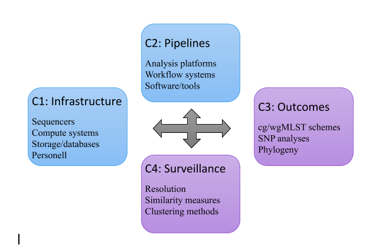

OneHealth ORION WP2-NGS HandBook
==============================================
This page will document the delivereables from OneHealth ORION WP2-NGS.

.. toctree::
   :maxdepth: 2
   :hidden:
   :caption: Main page
   
   about.rst
   policies.rst
   license.rst

.. toctree::
   :maxdepth: 2
   :hidden:
   :caption: Infrastruture
   
   Infrastructure/infrastructure.rst
   Infrastructure/lims.rst
   Infrastructure/sequencing_tech.rst
   Infrastructure/storage_compute.rst
   Infrastructure/db_management_analysis_platforms.rst
   
.. toctree::
   :maxdepth: 2
   :hidden:
   :caption: Pipelines
   
   Pipelines/pipelines.rst
   Pipelines/quality_control.rst
   Pipelines/data_production.rst
   Pipelines/insilico_WGS_methods.rst
   Pipelines/virulance_amr.rst
   
.. toctree::
   :maxdepth: 2
   :hidden:
   :caption: Typing
   
   Typing/typing.rst
   Typing/species_strain_typing_methods.rst
   
.. toctree::
   :maxdepth: 2
   :hidden:
   :caption: Surveillance
  
   Surveillance/surveillance.rst
   Surveillance/ngs_cluster_outbreak.rst
   
.. toctree::
   :maxdepth: 2
   :hidden:
   :caption: Contributing 
   
   Contributing/contributing.rst
   Contributing/code_of_conduct.rst
    
One health surRveillance Initiative On harmonization of data collection and interpretatioN (ORION)
================================================================================================

The ORION project, launched in 2018, aims at establishing and strengthening inter-institutional collaboration and transdisciplinary knowledge transfer in the area of surveillance data integration and interpretation, along the One Health (OH) objective of improving health and well-being. 

Through three main work packages (WP), ORION’s specific goals can be summarized as the delivery of three main resources: 

• a “OH Surveillance Codex” (WP1) - a high level framework for harmonised, cross-sectional description and categorisation of surveillance data covering all surveillance phases and all knowledge types; 
• a “OHS Knowledge Hub” (WP2) - a cross-domain inventory of currently available data sources, methods / algorithms / tools, that support OH surveillance data generation, data analysis, modelling and decision support; and 
• “OHS Infrastructural Resources” (WP3) – that are practical, infrastructural resources forming the basis for successful harmonisation and integration of surveillance data and methods. 

Developed solutions will be exemplified and validated during several One Health pilots, which will support the operationalization and implementation of OH surveillance solutions on a national level and provide crucial feedback for future development and dissemination actions. 

Trainings and workshops will be offered (WP4) to support and integrate with other EJP projects in their data harmonisation efforts.

ORION WP2-NGS
=============
***Lead: Karin Lagesen (NVI-NORWAY)***
***Deputy: Umaer Naseer (NIPH-NORWAY)***

**WP summary:**
The goal for this project is to create an OH Knowledge Base - a cross-domain inventory of currently available resources for performing integrated OH surveillance generation, data analysis and interpretation. The focus for the WP2NGS work package is on NextGen analytical data, methods, analyses and systems. The inventory generated from this work package will include best practices for data management and handling approaches for bacterial identification techniques. It should also include current experiences on practical issues such as data storage and exchange capacity, data exchange platforms, harmonised terminology, as well as the need for bioinformatics expertise. 
To better organize the work in this work package, we have further divided it into four focus areas, illustrated in Figure 1 below. This will also form the framework for the inventory.

**Figure 1:** The components that this WP consists of. Blue boxes describe species-agnostic processes, while the purple ones depend on which biological agent is being analysed.

**C1: Infrastructure**
The focus for this component is on exploring, testing and evaluating options and requirements for establishing possible infrastructures for using NGS methods for surveillance purposes. This component spans from sequencers, to compute systems, storage and databases, user interaction systems, data management and data transfer, as well as discussions regarding needed expertise. 
The goal for the component is to document the trials and tribulations that come with implementing NextGen technologies for surveillance purposes, and to suggest possible practical solutions depending on results needed and available resources.

**C2: Analysis pipelines**
The focus for this component is on exploring, testing and evaluating various possible workflow systems and bacterial typing pipelines for a select group of bacterial agents. We will be exploring issues surrounding reproducibility, reliability, scalability, ease of maintenance and updateability, as well as possibilities for expanding the pipelines to perform novel analyses. We will be exploring pipelines for various types of bacterial typing, including cg/wgMLST and SNP-based pipelines. This work also includes pipelines for virulence and AMR detection. 

The goal of this component is to document the implementation and practical use of one of more bacterial typing pipelines for surveillance use. 

**C3: Analysis pipeline outcomes**
This component focuses on the various typing schemas that exist for bacterial typing, as well as the underlying databases and references needed for running analyses. We will here be cataloguing and describing which schemas exist, which schemas are in use, and any information that is available regarding how changing schemas and databases affect results. Similar work will also be done with regards to virulence and AMR detection.

**C4: Surveillance** 
We will in this component examine how the results from various methods from components 2 and 3 can be used for surveillance purposes. Included here is how the various outcomes from component 3 will affect the surveillance process, and the conclusions drawn on the basis of such data. A major factor here is how the different levels of resolution provided by the various methods can affect the results. We will also explore and evaluate various similarity measures, as well as clustering methods based on such measures. 

**Pilot work**
During 2019, a pilot will be run within this WP to help explore and develop the knowledge needed to fill the inventory in a satisfactory manner. Based on preliminary analyses, we have discovered that there is quite a bit done already regarding components 2 and 3, thus we will for the main part focus on components 1 and 4. To accomplish this, we will proceed along three different tracks:
Infrastructure track: we will explore what is needed with regards to infrastructure for using sequencing for bacterial typing as well as virulence and AMR detection by literature reviews, interviewing other institutions, and by setting up a joint infrastructure between the NIPH and the NVI in Oslo.

**Pipeline track:** we will explore a subset of available workflow systems and pipelines by implementing them on the aforementioned infrastructure.
**Surveillance track:** we will explore and test out various analyses that are available for doing surveillance based on NextGen data. 

**Inventory**
The results of the work done in the pilot, as well as work done otherwise in the work package, will be available in a “Surveillance NextGen Handbook” which will be made available throughout this project. We will make several draft versions of this handbook available throughout the work, to get community input and to ensure community support.

